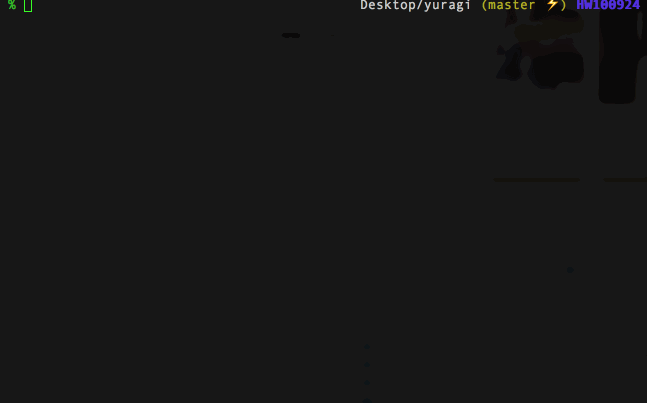

ゆらぎ候補語ジェネレータ
===

## Description
与えられた文から、ゆらぎ語と思われる単語のリストを作成します。

ゆらぎ語とは、会話やSNSなどで用いやすいように短縮された別名のことです。
例えば、テレビ番組の『逃げるは恥だが役に立つ』のゆらぎ語は「逃げ恥」です。

このプログラムは、ゆらぎ語を作成するのではなく、ゆらぎ語になる可能性を持った単語のリストを作成します。
リストの中からどの語がゆらぎ語になるかは、利用者が特定する必要があります。

## Demo



## Requirement
- python3.5.2 +
- jaconv
- MeCab
- [mecab-ipadic-neologd](https://github.com/neologd/mecab-ipadic-neologd)

## Usage
|変数名 / メソッド名|説明|
|-|-|
|Yuragi.text|元になる文字列|
|Yuragi.generate()|元になる文字列から、ゆらぎ候補語を作成する|
|Yuragi.get_words()|過去に作成されたゆらぎ候補語を取得する<br>※未作成の場合は空が返ってくる|

```
>>> from yuragi import Yuragi
>>> yuragi = Yuragi('転生したらスライムだった件')
>>> yuragi.text
'転生したらスライムだった件'
>>> yuragi.generate()
{'divided': [], 'unique_katakana': ['スライム'], 'combined': ['スけん', '転生ス', 'てんケン', 'てんけん', 'ス件', 'てん*', 'テン件', '転生ケン', 'しケン', 'てんシ', '転*', '転生スラ', '*ケン', 'テンシ', 'スラケン', 'てんスラ', 'テンスラ', 'シス', 'し件', 'し*', 'シ件', '転生件', '転ス', 'テンス', 'テンけん', 'しスラ', '転し', 'シ*', 'しけん', 'シケン', 'スラ件', 'しス', '転スラ', 'シけん', '転生シ', '転件', 'てんス', 'スラけん', '*けん', 'スケン', '転生し', 'シスラ', 'テンし', 'てんし', '転シ', '転けん', '転生けん', 'テン*', '*件', '転ケン', 'てん件', '転生*', 'テンケン']}
>>> yuragi.get_words()
['スけん', '転生ス', 'てんケン', 'てんけん', 'ス件', 'てん*', 'テン件', '転生ケン', 'しケン', 'てんシ', '転*', '転生スラ', '*ケン', 'テンシ', 'スライム', 'スラケン', 'てんスラ', 'テンスラ', 'シス', 'し件', 'し*', 'シ件', '転生件', '転ス', 'テンス', 'テンけん', 'しスラ', '転し', 'シ*', 'しけん', 'シケン', 'スラ件', 'しス', '転スラ', 'シけん', 'てん件', '転生シ', '転件', 'てんス', 'スラけん', '転ケン', '*けん', 'スケン', '転生し', 'シスラ', 'テンし', 'てんし', '転シ', '転生けん', 'テン*', '転けん', '*件', '転生*', 'テンケン']
```

## Install
- MeCabをインストールします
- MeCabをpythonで使えるようにします（例：mecab-pythonをインストールする）
- mecab-ipadic-neologdをインストールします（MeCabの最新辞書）
- mecab-ipadic-neologd のインストールパスが `yuragi/settings.py` に記載されているパスと異なる場合、ローカルのパスに書き換えてください
